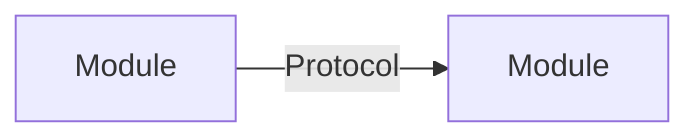

---
# Options Sheet
id: <intake-id>-options
intake_id: intake-<YYYY-MM-DD>-<slug>
created: YYYY-MM-DD
status: DRAFT | READY_FOR_DECISION
recommended_option: A | B | C
---

## Option A — <name>
**Summary**: ...



**Quality Attribute Scoring** (H=3 M=2 L=1)
| QA | Weight | Score | Weighted |
|----|--------|-------|---------|
| Simplicity | 5 | H | 15 |
| Testability | 5 | H | 15 |
| Modifiability | 4 | M | 8 |
| Performance | 2 | M | 4 |
| Migration Cost | 3 | L | 3 |
| **Total** | | | **45** |

**Sensitivity Points**: <!-- QA decisions with large impact -->
**Tradeoff Points**: <!-- improves X, hurts Y -->
**Effort**: Nh (within / exceeds appetite)
**Migration Path**: ...

---
## Option B — <name>
<!-- same structure -->

---
## Recommendation
Option [X] recommended because [rationale].

## Handoff
```yaml
from_step: S3
to_step: S4
agent: nowu-decider
status: READY_FOR_DECISION
```
