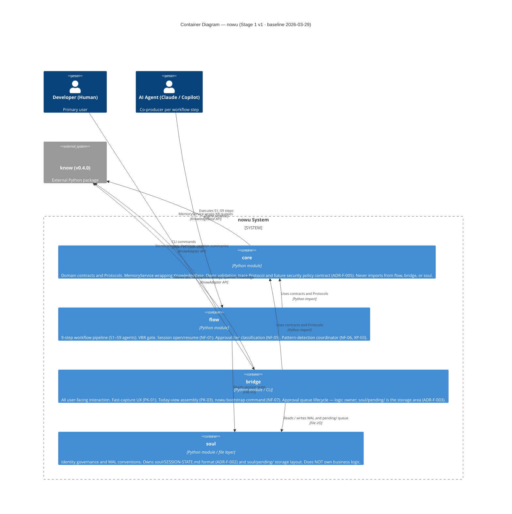

# nowu — Containers (C4 L2)

> Baseline established by Global Architecture Pass 2026-03-29 (FULL_RESET).
> No prior `containers.md` existed. This is the first authoritative C4 L2 document.

> **`dash` — FUTURE / BLOCKED.**
> Not shown in the diagram above. See the `dash` section below.
> A `dash/` directory appearing in the repo before the activation gate is an architecture violation.

---

## Container Responsibilities

### `core` — Domain Contracts Layer

**Technology:** Python module (DDD domain layer)
**Responsibility:** Owns all cross-module Protocols, domain types, and the `MemoryService`. The single place where cross-module contracts are defined. All other modules import from `core`; `core` never imports from `flow`, `bridge`, or `soul`.

Current ownership:
- All Protocols declared in `core/contracts/`
- `MemoryService` (wraps `KnowledgeBase` access for `know`)
- `validation_trace` Protocol (NF-09 traceability requirement)
- Future: security policy Protocol when ADR-F-005 is ACCEPTED

**Key constraints:**
- Domain code must not import from infrastructure (D-002, non-renegotiable)
- ADR-F-005 must be ACCEPTED before any implementation co-locates personal (PK) atoms with business (AP/RE) atoms

---

### `flow` — Workflow Pipeline

**Technology:** Python module (DDD application layer)
**Responsibility:** Implements the 9-step nowu workflow (S1–S9). Owns the VBR gate, session open/resume logic, and pattern-detection coordinator. Delegates all durable storage to `know` via `core/contracts/`.

Current ownership:
- S1–S9 agent orchestration (linear pipeline, D-009)
- VBR gate (hook-driven, D-004)
- Session resume after context loss (NF-01)
- Approval tier classification (NF-05)
- Pattern-detection trigger and escalation logic (NF-06, XP-03) — detection algorithm lives here; lesson storage lives in `know`

**Key constraint:** No DAG-based orchestrator or parallel agent execution for Stage 1 (D-009; P3 constraint 7).

---

### `bridge` — User Interface / CLI

**Technology:** Python module / CLI (DDD interface layer)
**Responsibility:** All user-facing interaction. Provides fast-capture UX, today-view assembly, `nowu bootstrap` command, and manages the approval queue stored in `soul/pending/`. Reads policy from `core` before surfacing knowledge results to the user.

Current ownership:
- Fast-capture command (PK-01, Step 05)
- Today-view summary (PK-03, Step 05)
- `nowu bootstrap <project>` (NF-07)
- Approval queue management — `bridge` is the logic owner; `soul/pending/` is the physical storage (ADR-F-003 governs schema)
- Policy enforcement before exposing knowledge results (ADR-F-005 will formalise the check)

---

### `soul` — Identity and State Layer

**Technology:** Python module + filesystem conventions
**Responsibility:** Owns the WAL schema for `soul/SESSION-STATE.md` and the storage layout of `soul/pending/`. Provides identity governance documents for the nowu project. Does NOT own business logic — it is a storage and convention layer only.

Current ownership:
- `soul/SESSION-STATE.md` WAL format and checkpoint schema (ADR-F-002 governs)
- `soul/pending/` directory as the physical store for approval queue items (read/written by `bridge`)
- Identity governance documents for the nowu project

---

### `know` (external) — Knowledge System of Record

**Technology:** External Python package, v0.4.0 (sibling repo)
**Responsibility:** Durable storage and retrieval of all structured knowledge: atoms, connections, TASK atoms, DECISION atoms, lessons. Accessed exclusively via `KnowledgeBase` and `KnowAdapter` instance methods.

Access contract defined in D-006. No internal `know` reimplementation is permitted. Any new `know` capability (decay, synthesis, contradiction detection) requires either a contribution to the `know` project or a wrapping service in `core`.

**Open ADR:** ADR-F-001 governs the `know` version contract and upgrade policy.

---

### `dash` — Visualization and Reporting UI *(FUTURE — BLOCKED)*

<!--
NOTE: This container does not yet exist and must not be scaffolded.

Activation gate (BOTH conditions required):
  1. ADR-F-008 is ACCEPTED — defines scope, import rules, and dependency chain
  2. Product is at Stage 2 or later

Triggered by: NF-08, AP-07, RE-07

A dash/ directory appearing in the repository before this gate is an architecture
violation per P3 constraint 6 below.

Once created: dash may only import from core contracts. It must NOT import from
flow internals. It may read from bridge outputs or core directly.
-->

---

## P3 Constraints *(effective 2026-03-29)*

These constraints apply to all P3 Architecture Bootstrap runs from this baseline forward.

1. **No new top-level module without a superseding ADR to D-003.** The 5-module structure (`core`, `flow`, `bridge`, `soul`, external `know`) is validated for all ACTIVE v1 use cases and must not be extended without a formal decision.

2. **`know` is the only permitted durable state store.** No module may open its own database, write its own structured index, or persist structured in-memory state between sessions outside of `soul/SESSION-STATE.md` (WAL, governed by ADR-F-002) and `soul/pending/` (approval queue, governed by ADR-F-003). File-system Markdown artifacts remain valid as workflow state (D-001).

3. **All cross-module API surfaces must be declared as Protocols in `core/contracts/` before any code is written against them.** A contract file is the gate between shaping (S5) and implementation (S6). S6 may not begin without a merged contract.

4. **Domain-specific UCs (AP, RE, PK) must be implemented through `know` project_scope isolation — not through new modules.** Adding a domain justifies a new project_scope value and possibly a new `bridge` command; it does not justify a new top-level module. This constraint may only be relaxed by an ADR that supersedes D-003 and resolves ADR-F-004.

5. **ADR-F-005 (security model) must be ACCEPTED before any implementation co-locates personal knowledge (PK-06 class atoms) with business knowledge (AP/RE) in the same `know` instance.** This is a security constraint, not a preference.

6. **`dash` may not be scaffolded until ADR-F-008 is ACCEPTED and the product is at Stage 2 or later.** A `dash/` directory appearing in the repo before this gate is an architecture violation.

7. **The linear role pipeline (D-009) is fixed for Stage 1.** P3 may not propose a DAG-based orchestrator or parallel agent execution for any Stage 1 epic. This decision may be revisited at the Stage 1 → Stage 2 transition.

8. **All new public functions in `core`, `flow`, and `bridge` must have failing tests written before implementation (D-004, TDD constraint).** A P3 architecture bootstrap that produces a task spec without explicit acceptance criteria and test stubs is incomplete. S6 may not begin.
