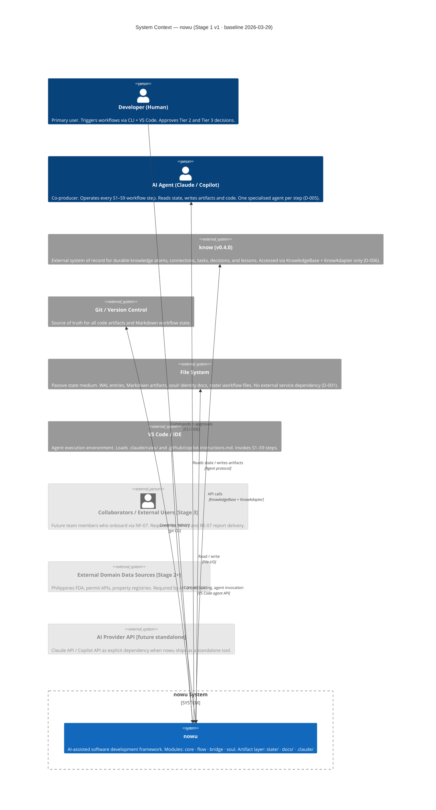

# nowu — System Context (C4 L1)

> Baseline established by Global Architecture Pass 2026-03-29 (FULL_RESET).
> No prior `context.md` existed. This is the first authoritative C4 L1 boundary document.

## External Actor Reference

| Actor | Role | Direction | Stage |
|---|---|---|---|
| **Developer (Human)** | Primary user. Triggers workflows via CLI + VS Code; approves Tier 2/3 decisions. Secondary persona: small-team lead. | → nowu System | v1 — active |
| **AI Agent (Claude / Copilot)** | Co-producer. Dedicated specialised agent per workflow step (D-005). Writes code and artifacts. | ↔ nowu System | v1 — active |
| **`know` (v0.4.0)** | External system of record for all durable knowledge. No internal reimplementation permitted (D-006). Access via `KnowledgeBase` + `KnowAdapter` only. | nowu → know | v1 — active |
| **Git / Version Control** | Source of truth for code artifacts and Markdown state. Decision memory belongs to `know`, not Git. | nowu → Git | v1 — active |
| **File System** | Passive medium for WAL entries, Markdown artifacts, `soul/` identity files, and `state/` workflow state. | ↔ nowu | v1 — active |
| **VS Code / IDE** | Loads `.claude/rules/`, `.github/copilot-instructions.md`. Invokes agent steps. Becomes explicit if nowu ships standalone. | → nowu | v1 — active |
| **Collaborators / External Users** | Future: team members onboarding via NF-07; targets for AP-07, RE-07 reports. | → nowu | Stage 3 |
| **External Domain Data Sources** | Future: Philippines FDA, permit APIs, property registries. Required by AP-01, RE-01. | nowu → sources | Stage 2+ |
| **AI Provider API** | Future: explicit Claude API / Copilot API dependency when nowu ships as a standalone tool. | nowu → provider | Standalone product |
