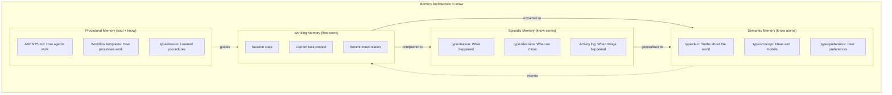
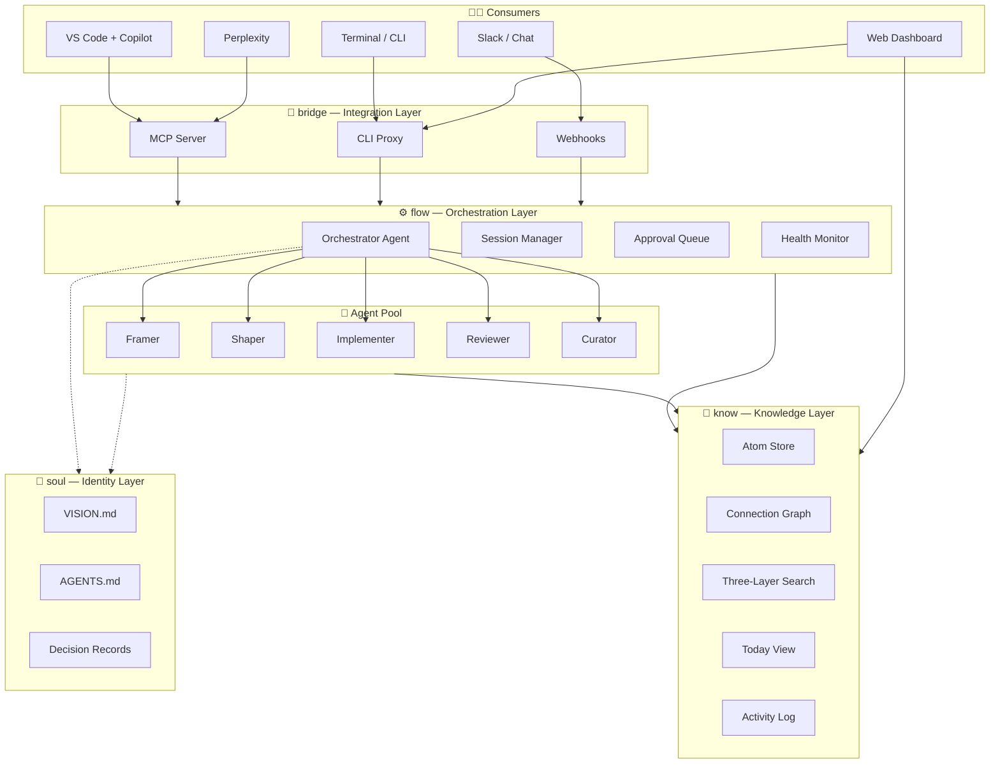

```mermaid
graph TB
    subgraph MEMORY["Memory Architecture in know"]
        subgraph WM["Working Memory (flow owns)"]
            WM1["Session state"]
            WM2["Current task context"]
            WM3["Recent conversation"]
        end
        subgraph EM["Episodic Memory (know atoms)"]
            EM1["type=lesson: What happened"]
            EM2["type=decision: What we chose"]
            EM3["Activity log: When things happened"]
        end
        subgraph SM["Semantic Memory (know atoms)"]
            SM1["type=fact: Truths about the world"]
            SM2["type=concept: Ideas and models"]
            SM3["type=preference: User preferences"]
        end
        subgraph PM["Procedural Memory (soul + know)"]
            PM1["AGENTS.md: How agents work"]
            PM2["Workflow templates: How processes work"]
            PM3["type=lesson: Learned procedures"]
        end
    end

    WM -->|compacted to| EM
    WM -->|extracted to| SM
    EM -->|generalized to| SM
    SM -.->|informs| WM
    PM -.->|guides| WM
```

```mermaid
graph TB
    subgraph CONSUMERS["🧑‍💻 Consumers"]
        VS["VS Code + Copilot"]
        PERP["Perplexity"]
        CLI["Terminal / CLI"]
        SLACK["Slack / Chat"]
        WEB["Web Dashboard"]
    end

    subgraph BRIDGE["🔌 bridge — Integration Layer"]
        MCP["MCP Server"]
        CLIP["CLI Proxy"]
        HOOK["Webhooks"]
    end

    subgraph FLOW["⚙️ flow — Orchestration Layer"]
        ORCH["Orchestrator Agent"]
        SESSION["Session Manager"]
        APPROVE["Approval Queue"]
        HEALTH["Health Monitor"]
    end

    subgraph AGENTS["🤖 Agent Pool"]
        FRAMER["Framer"]
        SHAPER["Shaper"]
        IMPL["Implementer"]
        REVIEW["Reviewer"]
        CURATOR["Curator"]
    end

    subgraph KNOW["🧠 know — Knowledge Layer"]
        ATOMS["Atom Store"]
        GRAPH["Connection Graph"]
        SEARCH["Three-Layer Search"]
        TODAY["Today View"]
        ACTIVITY["Activity Log"]
    end

    subgraph SOUL["💎 soul — Identity Layer"]
        VISION["VISION.md"]
        AGENTSMD["AGENTS.md"]
        ADR["Decision Records"]
    end

    VS --> MCP
    PERP --> MCP
    CLI --> CLIP
    SLACK --> HOOK
    WEB --> CLIP

    MCP --> FLOW
    CLIP --> FLOW
    HOOK --> FLOW

    ORCH --> FRAMER
    ORCH --> SHAPER
    ORCH --> IMPL
    ORCH --> REVIEW
    ORCH --> CURATOR

    FLOW --> KNOW
    AGENTS --> KNOW
    WEB --> KNOW

    ORCH -.-> SOUL
    AGENTS -.-> SOUL
```