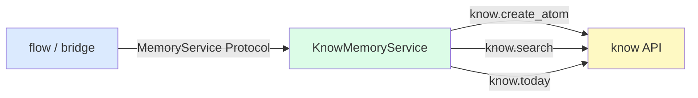
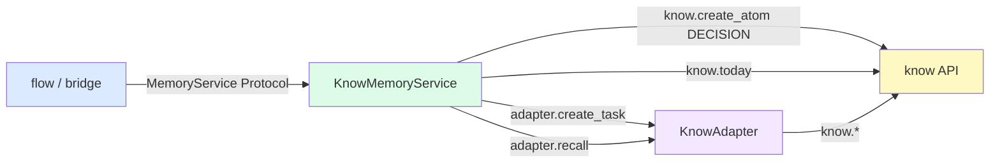
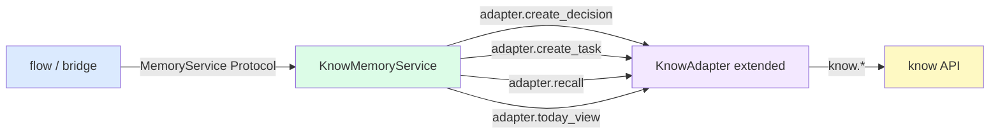

---
# Options Sheet
id: 2026-03-22-memory-integration-options
intake_id: intake-2026-03-22-memory-integration
created: 2026-03-22
status: READY_FOR_DECISION
recommended_option: B
---

> **⚠️ STALE**: This document references `know` v0.3 API (`know.init()`, `know.today()`, `KnowAdapter.create_task()`).
> As of know v0.4.0, all operations are instance methods on `KnowledgeBase`.
> See `know/docs/adr/ADR-0005-class-based-api.md` for the breaking changes.
> The option analysis logic is still valid; implementation details must use the new class API.

## Pre-Analysis: know v0.3.0 API Verification

> Resolved from S2 Open Questions before designing options.

**`know.today()` return shape** (S2 OQ-1 ✅ resolved):
Returns `dict` with keys: `tasks_due`, `overdue`, `in_progress`, `high_priority`, `date`.
Shape is concrete and stable — no `TodayView` dataclass needed for v1.

**`DecisionRecord` → `KnowledgeAtom` mapping** (S2 OQ-2 ✅ resolved):
| `DecisionRecord` field | `KnowledgeAtom` mapping |
|---|---|
| `title` | `title` |
| `rationale` | `content` |
| `risks` + `mitigations` | Appended to `content` as markdown sections |
| `use_case_ids` | `tags` (prefixed: `"uc:NF-01"`) |

**`recall_context` return type** (S2 OQ-4 ✅ resolved):
`know.search()` returns `list[SearchResult]`. The Protocol's `list[Any]` is a placeholder.
Implementation should return `list[SearchResult]` — Protocol update needed.

**`KnowAdapter` gap** (S2 OQ-3 partially resolved):
`KnowAdapter` has: `create_action`, `create_task`, `link`, `recall`, `context_subgraph`.
It does NOT have: `create_decision()` or `today_view()`. These must be handled somehow.

**Version discrepancy** ⚠️ RISK:
`know/pyproject.toml` says v0.3.0 but `know/src/know/__init__.py.__version__` says `"0.1.0"`.
The installed editable package is v0.3.0 (pyproject.toml). The API surface we see is current.
This is a `know` housekeeping issue — does not block nowu implementation but should be flagged.

---

## Option A — Direct `know` API Calls (Flat Integration)

**Summary**: `KnowMemoryService` calls `know.*` module-level functions directly.
No `KnowAdapter` intermediary. Initialization handled externally (caller must call `know.init()`).



**Quality Attribute Scoring** (H=3 M=2 L=1)

| QA | Weight | Score | Weighted |
|----|--------|-------|---------|
| Simplicity | 5 | H | 15 |
| Testability | 5 | L | 5 |
| Modifiability | 4 | M | 8 |
| Type Safety | 4 | M | 8 |
| Migration Cost | 3 | H | 9 |
| **Total** | | | **45** |

**Pros**
- Fewest lines of code — no adapter wrapping overhead
- No dependency on `KnowAdapter` — direct and transparent
- Migration path is trivial (no scaffolding to write first)

**Cons**
- `know.*` functions use global state — `know.init()` must be called before any method
- Hard to mock in unit tests — requires either `monkeypatch` on module globals or integration-only tests
- Mixes initialization responsibility: MemoryService depends on caller having set up global `know` state
- Violates spirit of D-002 (domain layer should not depend on infrastructure details of `know` initialization)

**Sensitivity Points**
- If `know` changes its global init pattern, all direct callers break
- If test isolation requires independent `know` instances, global state makes this painful

**Tradeoff Points**
- Simplicity ↑ but Testability ↓ — unit tests become integration tests
- Migration Cost ↓ but Modifiability ↓ — any `know` API change propagates directly into MemoryService

**Effort**: ~3h (within appetite)

**Migration Path**: Write `KnowMemoryService` class with 4 methods calling `know.*` directly.
Tests require a real temp `KNOW_DATA_DIR` (integration-only).

---

## Option B — Stateful `KnowMemoryService` wrapping `KnowAdapter` (V1_PLAN Choice)

**Summary**: `KnowMemoryService` accepts a `KnowAdapter` instance via `__init__`.
Calls `adapter.*` for task/recall/subgraph operations, and `know.*` directly for
`create_atom(DECISION)` and `today()` — since `KnowAdapter` has no dedicated methods for these.
Initialization (`know.init()`) happens in the constructor.



**Quality Attribute Scoring** (H=3 M=2 L=1)

| QA | Weight | Score | Weighted |
|----|--------|-------|---------|
| Simplicity | 5 | M | 10 |
| Testability | 5 | H | 15 |
| Modifiability | 4 | H | 12 |
| Type Safety | 4 | M | 8 |
| Migration Cost | 3 | M | 6 |
| **Total** | | | **51** |

**Pros**
- `KnowAdapter` is injectable → `KnowMemoryService` can be unit-tested by mocking the adapter
- Aligns with V1_PLAN documented choice (Option B) — no architectural rework
- `know.init()` called once in constructor with explicit `data_dir` parameter → initialization is explicit, not hidden
- `flow` / `bridge` never touch `KnowAdapter` or `know` directly — clean single point of entry

**Cons**
- `record_decision` and `today_view` must call `know.*` directly (adapter gap) — mixed access pattern
- Two code paths to mock in tests: adapter mock + `know.*` module mock
- Slight inconsistency: "everything through adapter" principle is partially broken

**Sensitivity Points**
- If `KnowAdapter` gains `create_decision()` in a future `know` release, Option B becomes Option C automatically — the gap is localized
- `data_dir` must be passed consistently — if two components initialize with different dirs, state diverges

**Tradeoff Points**
- Testability ↑ (adapter injection) but Simplicity ↓ (more scaffolding vs. Option A)
- Mixed access pattern is a code smell, but it's bounded to 2 out of 4 methods

**Effort**: ~5h (within 8h appetite)

**Migration Path**:
1. Write `KnowMemoryService.__init__(adapter: KnowAdapter, data_dir: Path)` calling `know.init()`
2. Implement `create_task` + `recall_context` via adapter
3. Implement `record_decision` via `know.create_atom(type=DECISION)`
4. Implement `today_view` via `know.today()`
5. Update Protocol: `recall_context` return type `list[Any]` → `list[SearchResult]`
6. Write integration tests using temp `KNOW_DATA_DIR`

---

## Option C — Extend `KnowAdapter` + Full Adapter Encapsulation

**Summary**: Add `create_decision()` and `today_view()` to `KnowAdapter` in the `know` project.
Then `KnowMemoryService` uses ONLY `KnowAdapter` methods — zero direct `know.*` calls.
Also refines Protocol return types: `list[Any]` → `list[SearchResult]`, `dict[str, Any]` → `TodayView`.



**Quality Attribute Scoring** (H=3 M=2 L=1)

| QA | Weight | Score | Weighted |
|----|--------|-------|---------|
| Simplicity | 5 | L | 5 |
| Testability | 5 | H | 15 |
| Modifiability | 4 | H | 12 |
| Type Safety | 4 | H | 12 |
| Migration Cost | 3 | L | 3 |
| **Total** | | | **47** |

**Pros**
- Cleanest design: MemoryService has exactly one dependency (`KnowAdapter`)
- Fully mockable with a single mock object
- Return types are concrete (`list[SearchResult]`, typed `today` dict) → `mypy --strict` fully satisfied without `cast()`
- `know` adapter becomes the stable integration surface — future `know` API changes only affect adapter

**Cons**
- Requires modifying `know` project (different repo, separate task, cross-project change)
- **Tier 3 gate**: Adding methods to `KnowAdapter` in `know` is a breaking-change-adjacent modification to a dependency — requires explicit approval per workflow rules
- Increased scope — estimated 2h additional for the `know` side changes
- `TodayView` dataclass adds a type shared across both projects — coupling increases

**Sensitivity Points**
- Cross-project dependency: if `know`'s `KnowAdapter` changes API, nowu's `KnowMemoryService` must also update
- `TodayView` as a shared type: which project owns it? If it lives in `know`, nowu imports it. If in `nowu/core`, `know` can't use it — creates a type duplication risk.

**Tradeoff Points**
- Type Safety ↑ and Modifiability ↑ but Migration Cost ↑↑ — requires work in two repos
- Cleanest architecture now, but highest effort and cross-project coordination risk

**Effort**: ~7h (at appetite boundary; risk of overrun if `know` changes are more complex than expected)

**Migration Path**:
1. (In `know`) Add `create_decision()` and `today_view()` to `KnowAdapter`
2. (In `know`) Run `know` tests to confirm no regression
3. (In `nowu`) Implement `KnowMemoryService` using only adapter methods
4. (In `nowu`) Update Protocol with concrete return types
5. (In `nowu`) Write integration tests

---

## Recommendation

**Option B** is recommended.

**Rationale**:
Option B scores highest (51 vs. 47 vs. 45) and is aligned with V1_PLAN's documented decision (Option B was already chosen). More importantly:

- The "mixed access pattern" downside is bounded and explicit — only 2 of 4 methods call `know.*` directly, and both are simple one-liners (`know.create_atom()`, `know.today()`). This is not architectural drift; it is a pragmatic gap-fill.
- Option C's cleaner design comes at the cost of a cross-project change, which is a Tier 3 gate. For an 8h appetite task, spending 2h on `know` modifications before writing a single line of `nowu` implementation is poor value.
- Option A's testability problem is disqualifying. Integration-only tests for a core service make TDD (D-004) painful and slow.

**Key tradeoff accepted**: Slightly impure adapter usage (2 direct `know.*` calls) in exchange for staying within appetite and avoiding cross-project scope creep.

**One additional action**: Update `Protocol.recall_context` return type from `list[Any]` to `list[SearchResult]`. This is a safe change — `flow` and `bridge` are stubs only, no consumers to break.

## Handoff
```yaml
from_step: S3
to_step: S4
agent: nowu-decider
status: READY_FOR_DECISION
```
