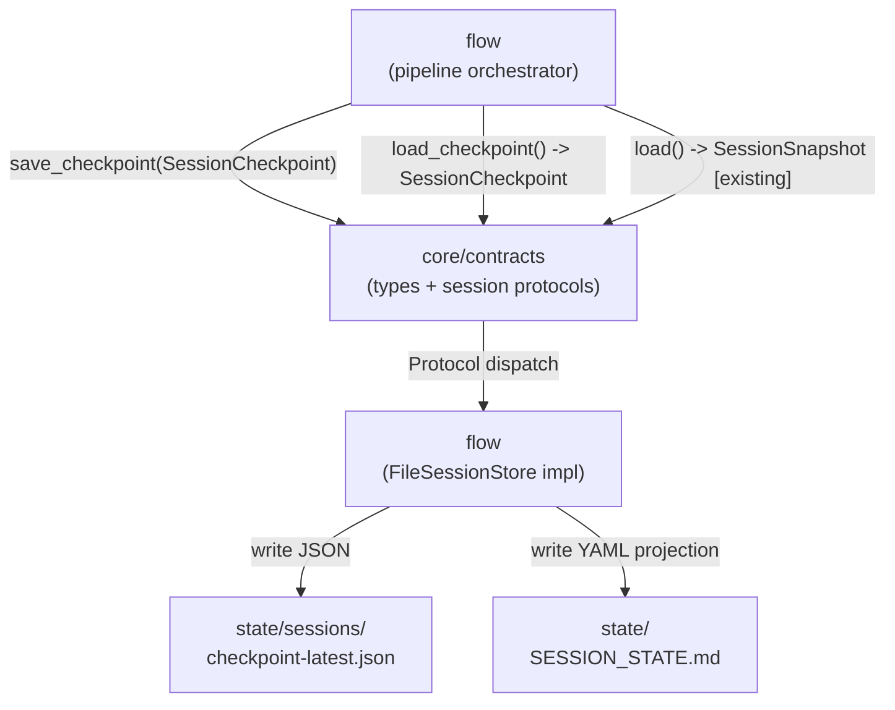
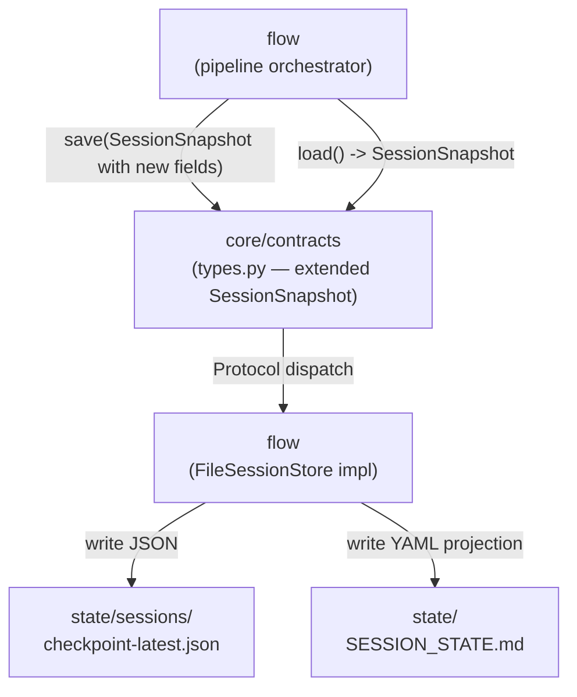
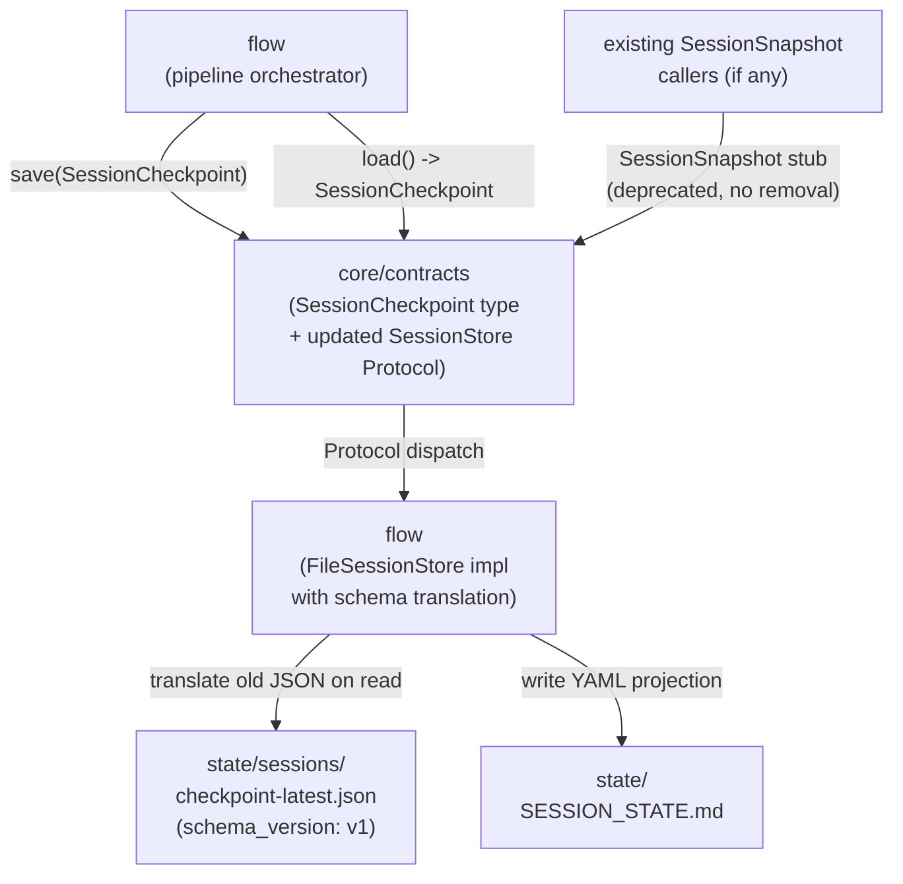

# Options Sheet: intake-001 — Resume Work After Context Loss

## Sensitivity and Tradeoff Points (Global)

**Sensitivity point S1 — Protocol signature change.**
Any option that introduces `SessionCheckpoint` as a type distinct from `SessionSnapshot`
must update `SessionStore.save(snapshot: SessionSnapshot)`. That signature change is a
Tier 3 action. Options A and C both trigger it. Option B avoids it entirely. This is the
single decision that most affects migration cost and risk.

**Sensitivity point S2 — Frozen dataclass extension.**
`SessionSnapshot` is `frozen=True`. Adding new fields with `field(default=None)` preserves
the frozen property and backward compatibility with all existing callers — no field is
required. This makes Option B less disruptive than the S2 constraints sheet implies.

**Tradeoff point T1 — Type simplicity vs. contract stability.**
Option B gives the simplest type system (one type) but forces every current caller of
`SessionStore` to accept Optional fields in their `SessionSnapshot`. Option A keeps
existing callers untouched but adds Protocol surface. Option C reduces long-term drift but
pays the Protocol change cost now.

---

## Option A: Parallel Type (Pre-workflow sketch — evaluated as required)

Introduce a new `SessionCheckpoint` dataclass in `core/contracts/types.py` alongside the
existing `SessionSnapshot`. Extend `SessionStore` with two new methods —
`load_checkpoint() -> SessionCheckpoint | None` and
`save_checkpoint(checkpoint: SessionCheckpoint) -> None` — leaving the existing
`load()`/`save()` signatures untouched. `flow` calls the new checkpoint path at step
boundaries; existing callers of the old path are unaffected. The human bookmark writer
lives in `flow`'s step-boundary hook and writes `state/SESSION_STATE.md` as a side effect
of `save_checkpoint()`. Migration from `SessionSnapshot` to `SessionCheckpoint` consumers
happens incrementally after v1-core.



| QA Attribute | Weight | Score | Weighted |
|---|---|---|---|
| Simplicity | 5 | M | 10 |
| Testability | 5 | H | 15 |
| Modifiability | 4 | M | 8 |
| Performance | 2 | H | 6 |
| Migration Cost | 3 | M | 6 |
| **Total** | | | **45** |

**Pros:**
- Existing `SessionStore.load()`/`save()` callers are completely unaffected — zero
  breakage risk for current code.
- `SessionCheckpoint` schema is explicit and clean; no Optional field pollution in the
  new type.

**Cons:**
- Two types in the contract surface for the same conceptual entity creates long-term
  confusion about which type to use where.
- Protocol surface grows by two methods. The `SessionStore` Protocol now has four method
  signatures; all concrete implementations must satisfy all four.

**Risks specific to this option:**
- The dual-path Protocol diverges permanently unless a deprecation plan for the old
  `load()`/`save()` path is committed to now. Without that commitment, both paths will
  coexist indefinitely.
- Any future caller that needs both types simultaneously (e.g., a migration helper)
  must understand the distinction — onboarding cost grows.

**Effort:** 7h — within 8h appetite (tight).
Schedule risk: Protocol surface expansion requires updating the concrete
`FileSessionStore` implementation with four methods, and TDD requires tests for all four
paths. 7h assumes no friction with existing `flow` step-dispatch hook.

**Migration path:** After v1-core validation, deprecate `load()`/`save()` with a
one-cycle notice, migrate remaining `SessionSnapshot` consumers to `SessionCheckpoint`,
then remove the old methods and type. Two-cycle migration.

---

## Option B: Extend Current Type

Extend `SessionSnapshot` in place by adding five new Optional fields with defaults:
`active_step: str | None`, `active_ids: dict | None`, `completed_steps: list[str]`,
`last_artifact_path: str | None`, `checkpoint_grade: str`. The dataclass remains
`frozen=True` — Optional fields with `field(default=None)` are fully compatible with
frozen semantics. `SessionStore.load()`/`save()` signatures are unchanged. `flow`
populates the new fields at step boundaries; callers that do not need them receive `None`
and require no changes. The human bookmark writer is a side effect of `save()` in the
concrete `FileSessionStore`.



| QA Attribute | Weight | Score | Weighted |
|---|---|---|---|
| Simplicity | 5 | H | 15 |
| Testability | 5 | H | 15 |
| Modifiability | 4 | L | 4 |
| Performance | 2 | H | 6 |
| Migration Cost | 3 | H | 9 |
| **Total** | | | **49** |

**Pros:**
- No Protocol signature changes — zero Tier 3 actions triggered. The existing
  `SessionStore.load()`/`save()` surface is untouched.
- One type in the entire system for session state. Callers reason about one concept.

**Cons:**
- `SessionSnapshot` grows Optional fields that are conceptually required for recovery but
  structurally optional in the type. This is a modifiability liability: future callers
  cannot tell which fields are "always present" vs. "checkpoint-only."
- The type mixes two concerns — the original minimal snapshot role and the full recovery
  checkpoint role — in a single dataclass. This violates single-responsibility at the
  domain model level and will require untangling at v1.

**Risks specific to this option:**
- D-017 (evidence run for ADR-0007) prescribes documenting friction. ADR-0007 explicitly
  proposes a `SessionCheckpoint` type. Implementing Option B diverges from the hypothesis
  being tested — this is valid only if friction is documented in S9 capture.
- Optional fields create silent partial-state bugs: a caller that pattern-matches on
  `snapshot.active_step` without checking for `None` will fail silently at runtime.
  TDD discipline (D-004) must cover all None-path branches.

**Effort:** 5h — well within 8h appetite.
Lowest implementation cost: one type change, no Protocol changes, one concrete
implementation to update.

**Migration path:** No migration required at v1-core. If `SessionCheckpoint` is
introduced at v1, `SessionSnapshot`'s Optional fields become the migration source.
One-time refactor at that point.

---

## Option C: Versioned Schema (Recommended)

Introduce `SessionCheckpoint` as the single authoritative session state type, replacing
`SessionSnapshot` as the type flowing through `SessionStore`. Update the Protocol to
`load() -> SessionCheckpoint | None` and `save(checkpoint: SessionCheckpoint) -> None`.
`SessionCheckpoint` carries all 10 fields from ADR-0007 — all required, no Optionals for
recovery-critical fields — plus a `schema_version: str` field. The concrete
`FileSessionStore` handles schema translation on read: if it finds an old
`SessionSnapshot` JSON (5-field format), it upgrades it to a `SessionCheckpoint` with
sensible defaults for the new fields. `SessionSnapshot` is retained as a read-only type
alias or deprecated stub — not deleted — so that any external callers have a clear
upgrade path. The human bookmark writer is a side effect of `save()`. This option tests
ADR-0007's hypothesis most directly (D-017).



| QA Attribute | Weight | Score | Weighted |
|---|---|---|---|
| Simplicity | 5 | M | 10 |
| Testability | 5 | H | 15 |
| Modifiability | 4 | H | 12 |
| Performance | 2 | H | 6 |
| Migration Cost | 3 | M | 6 |
| **Total** | | | **49** |

**Pros:**
- One type going forward. No dual-path Protocol, no Optional recovery fields. The type
  fully represents its intent: a recovery checkpoint.
- Schema versioning in the concrete implementation, not in the Protocol, keeps the
  contract surface clean. Future schema evolution follows the same pattern without
  Protocol changes.
- Most faithful test of ADR-0007's hypothesis (D-017): the implementation directly
  exercises the proposed `SessionCheckpoint` schema, producing maximal evidence for S9.

**Cons:**
- Protocol signature change (`save(SessionSnapshot)` → `save(SessionCheckpoint)`) is a
  Tier 3 action. S4 must explicitly approve it before S5 begins.
- Schema translation logic in `FileSessionStore` adds implementation complexity not
  present in Options A or B. Must be covered by tests (D-004).

**Risks specific to this option:**
- If existing code outside `flow` calls `SessionStore.save()` with a `SessionSnapshot`,
  it will fail at the type boundary after the Protocol update. S5 shaper must audit all
  call sites before implementation.
- The `schema_version` field establishes a versioning pattern — if the pattern is not
  followed consistently in future intakes, schema drift will occur silently. Must be
  documented in S9 as an architectural convention, not just an implementation detail.

**Effort:** 7h — within 8h appetite (tight, same as Option A).
The translation logic adds ~1h over Option B. Tier 3 approval step is required at S4
but does not consume implementation hours.

**Migration path:** At the S4 gate, approve the Protocol signature change. S5 audits
call sites (expected: none outside `flow` given the current empty `flow/__init__.py`
surface). `SessionSnapshot` is retained as a deprecated stub in `core/contracts/types.py`
with a docstring pointing to `SessionCheckpoint`. Removed at the next major intake that
touches contracts.

---

## Recommendation

**Option C is recommended.**

Options B and C score equally on the weighted QA matrix (49 each). The tiebreaker is
modifiability and D-017. Option B's Optional fields leave the type permanently ambiguous
about which fields are "always present" — this is a structural liability that will require
untangling at v1 regardless. Option C pays a small upfront cost (Tier 3 Protocol
approval, schema translation logic) to achieve a clean, intent-revealing type that fully
represents a recovery checkpoint. Critically, Option C is the only option that directly
tests ADR-0007's proposed `SessionCheckpoint` schema — as required by D-017. Option A is
not recommended: the dual-path Protocol surface solves a short-term compatibility problem
by creating a long-term divergence problem, and the migration cost is deferred rather than
eliminated. Given the 8h appetite, Option C's 7h estimate is tight but achievable
provided the S4 Tier 3 gate for the Protocol change is approved before S5 begins.

**Appetite flag:** All three options fit within the 8h appetite. Options A and C are both
at 7h with low schedule margin. If the S4 gate reveals unexpected call-site complexity,
S5 must narrow scope to the Protocol change + `flow` checkpoint write path only, deferring
the schema translation logic to a follow-on intake.

**Open questions resolved by this options sheet (from constraints sheet):**

1. `SessionCheckpoint` vs extension strategy: Option C — new type, Protocol updated,
   `SessionSnapshot` deprecated-in-place.
2. Minimum viable slice: Protocol update + `FileSessionStore` (write JSON + write
   `SESSION_STATE.md` bookmark) + `flow` step-boundary hook calling `save()`. Recovery
   read path (`load()` at session start) is the second deliverable. Cross-project
   orientation and `know` integration are out of scope.
3. Step-boundary writer in `flow`: a `checkpoint_at_step_boundary()` hook in `flow`'s
   pipeline dispatcher calls `SessionStore.save()` after each step completes. No new
   pipeline infrastructure required — hook into the existing step dispatch point.
4. Human bookmark writer: `FileSessionStore.save()` writes both the JSON checkpoint and
   the `state/SESSION_STATE.md` YAML projection atomically (write JSON first, then
   bookmark — if bookmark write fails, JSON checkpoint is still safe).
5. Hallucination guard (AC-3): enforced by `flow`'s session-start logic. At session
   start, `flow` calls `load()`, retrieves the `SessionCheckpoint`, and passes its content
   verbatim into the agent prompt as a structured context block before any reasoning
   begins. This is a flow-orchestration concern, not a data-model concern — no contract
   change required.

---

```yaml
from_step: S3
to_step: S4
agent: nowu-decider
intake_id: intake-001
status: READY_FOR_DECISION
recommended_option: C
tier3_actions_required:
  - "Update SessionStore Protocol: save(SessionSnapshot) -> save(SessionCheckpoint)"
  - "Update SessionStore Protocol: load() -> SessionSnapshot | None -> load() -> SessionCheckpoint | None"
```
