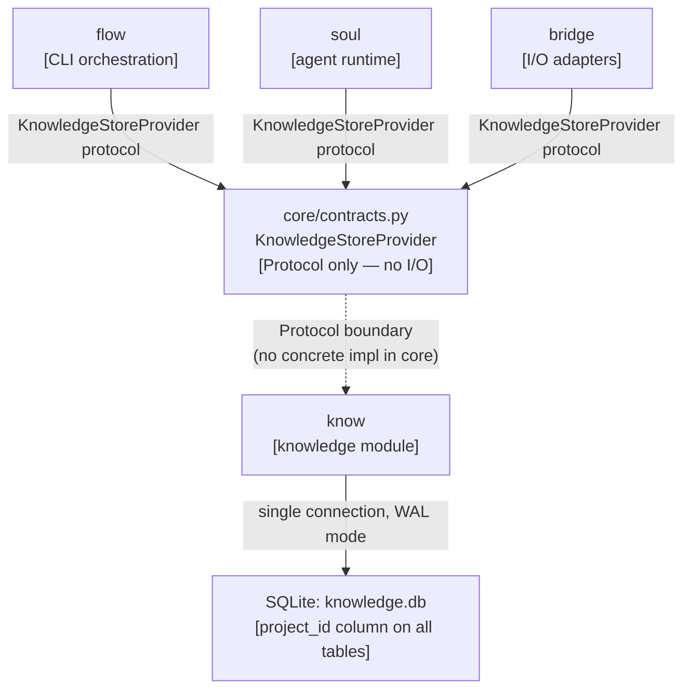
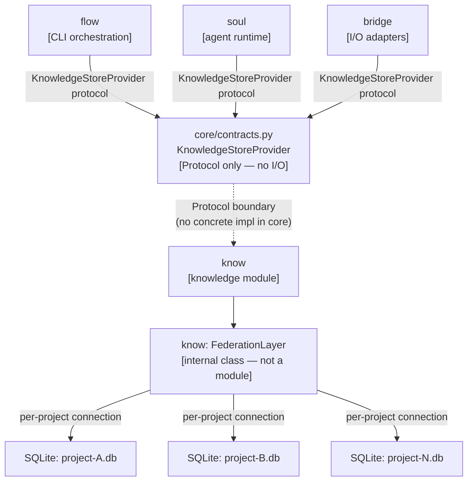

# Options Sheet — intake-003: Cross-Project Knowledge Architecture and DB Session Pattern

## Decision Space

This sheet covers two linked sub-questions from the global-pass (ADR-D and Q5). Q5 is not
an independent decision — it is derived structurally from ADR-D. Each option below states
its ADR-D choice first, then its Q5 corollary. Option C from the global-pass (per-project
Markdown dirs + semantic vector index) is dismissed as out of scope for v1-core: it
abandons the relational model locked in by D-001 and D-004, introduces unmeasured semantic
index performance risk, and defers clarity on every `know` schema question to a later
intake. It is not recommended and is not analysed further.

---

## Option 1: Single Shared SQLite DB with `project_id` Column (ADR-D Option A)

### Summary

`know` maintains one SQLite file (`knowledge.db`) used by all projects. Every row in every
table carries a `project_id` foreign key. Cross-project queries are plain `WHERE`-clause
variations. `know` holds one connection (WAL mode); no federation layer exists.

### C4 L2 Sketch

### Pros

- XP-01 (cross-project semantic search) is a trivial `WHERE project_id IN (...)` or full
  table scan — no federation layer, no fan-out latency, no materialized index to maintain.
- Single schema migration path: Alembic or versioned SQL scripts run once against one file.
- Connection management is minimal — one WAL-mode connection per process; no per-project
  handle bookkeeping.
- Lowest implementation effort of the two options; the `know` internals are conventional.

### Cons

- **XP-08 (per-project portable export) is structurally constrained.** A correct per-project
  export requires filtering every table by `project_id`, rebuilding foreign-key relationships,
  and deciding what to do with cross-project edges — atoms that reference entities across
  two projects cannot be cleanly split without semantic loss or duplication. The edge-ownership
  problem is not implementable away; it is a schema-design problem that must be resolved at
  ADR-D time (see Risk 1 below).
- **XP-10 (v2 multi-user) migration debt is significant.** Adding per-user row-level isolation
  to a single shared file requires a breaking schema migration: a new `user_id` column on all
  tables, updated indices, and potentially a new connection-per-user model. Under Option B this
  migration is structural — each user gets a directory of project files — not a schema rewrite.
- Single-file contention: heavy concurrent writes (multiple background agents) require careful
  WAL tuning; at v1-core scale this is manageable, but it is a hidden coupling point.

### Risks (Option-Specific)

**[HIGH] Edge ownership rule is required before XP-08 can be estimated.**
Cross-project relationship edges (e.g., an atom in project A that cites an atom in project B)
cannot be attributed to one project without a rule. Without the rule, XP-08 either duplicates
edges into both exports or silently drops them, both of which are wrong. S3 proposes the
following edge-ownership rule as a condition of recommending Option A:

> An edge belongs to the project that owns its source atom. On export, outbound edges
> whose target is in another project are replaced with a stub reference (a non-resolvable
> external ID). The exported file is self-contained but not semantically complete across
> project boundaries.

This rule is semantically consistent and implementable, but it means XP-08 exports are
not fully portable in the presence of cross-project references — they require the receiving
system to have the referenced atoms available under their external IDs to restore the link.
S4 must decide whether this is acceptable for v1.1.

**[MEDIUM] v2 migration from A to B is a destructive schema change.**
If Option A is chosen and v2 multi-user requirements (XP-10) make per-project file isolation
necessary, the migration path is: (1) for each distinct project_id in `knowledge.db`, export
all rows to a new per-project SQLite file, (2) reassign edge targets using the stub-reference
rule above, (3) drop the monolithic file. Step (2) is equivalent to the XP-08 export problem —
if the edge ownership rule is acceptable for XP-08, it is also the v2 migration rule. The
migration is automatable but destructive and requires a hard cutover.

### Effort Estimate (Spike Only — No Implementation Code)

ADR-D Option A decision document + Q5 corollary + edge-ownership rule definition: **2 hours**
(S4 decider review + DECISIONS.md entry). No implementation code follows from this spike.

### Migration Path (Switching Away from Option A)

If Option A proves wrong post-v1-core (e.g., XP-08 edge-loss is unacceptable to the human,
or v2 multi-user scope is confirmed earlier than expected): migrate to Option B using the
per-project export logic required for XP-08. The migration is automatable and reversible at
the data level. Schema versions must be monotonically increasing to allow Alembic to detect
the transition. Estimated migration effort at that point: 1 sprint (scoped intake, not a free
refactor).

### Q5 Implication

Under Option A, `know` owns one SQLite file and manages one connection. `core/contracts.py`
defines `KnowledgeStoreProvider` as a Protocol (abstract type, no import of any database
library, no I/O) — this satisfies fixed constraint 1. `know` provides the concrete
implementation of that Protocol, constructing its own connection at startup and exposing it
via the Protocol API. No session factory exists in `core`; `core` contains no `sqlite3` or
`sqlalchemy` imports. The `project_id` for the active project is passed to `know`'s
implementation via a constructor argument or initialization call (flexible parameter 4).

The `KnowledgeStoreProvider` Protocol name is proposed as scoped to `know` — not a
generic `DatabaseProvider` — to prevent future modules from misreading it as a general
persistence contract (risk 5 in constraints sheet). If any other module ever needs
persistence, a new Protocol is defined under its own name.

### Quality Attribute Scores

| Attribute       | Score | Notes                                                              |
|-----------------|-------|--------------------------------------------------------------------|
| Modifiability   | M     | XP-08 edge rule adds fragility; v2 migration is a hard cutover    |
| Testability     | H     | Single DB is trivial to seed and assert against in unit tests      |
| Simplicity      | H     | No federation layer; standard single-connection SQLite pattern     |
| Performance     | H     | XP-01 is a plain query; no fan-out latency                         |

---

## Option 2: Per-Project SQLite Files + `know`-Internal Federation Query Layer (ADR-D Option B)

### Summary

`know` maintains one SQLite file per project (`{project_id}.db`) in a user-controlled
directory. A federation query layer inside `know` (not a new module) fans out XP-01
cross-project queries across all project files and merges results. `know` manages N
connections (one per open project file); no shared DB exists. `core` holds only a
Protocol. This is the directionally preferred option from the global-pass.

### C4 L2 Sketch

### Pros

- **XP-08 per-project export is a file copy.** A project's entire knowledge state is
  one SQLite file. Export is `cp project-A.db export/project-A.db`. No edge-ownership
  rule is needed — cross-project edges do not exist inside a per-project file (they are
  represented as external ID references by design). Semantic completeness within a project
  is guaranteed.
- **Per-project isolation is structural, not schema-enforced.** There is no risk of a
  query accidentally returning atoms from another project due to a missing `WHERE` clause.
  Isolation bugs become filesystem-level bugs (opening the wrong file), which are easier
  to detect in tests.
- **v2 multi-user migration is additive, not destructive.** Each user maps to a directory
  of project files. Adding a second user means creating a second directory; no schema
  migration is required. XP-10 is handled at the directory-routing layer inside `know`,
  not at the schema layer.
- Consistent with the "modules own their state" principle — `know` owns its files
  exclusively; no other module has any claim on them.

### Cons

- **Federation query layer is additional code inside `know`.** Fan-out across N SQLite
  files at query time requires opening N connections, executing N queries (or N ATTACH
  statements), and merging result sets. This is non-trivial to implement correctly for
  semantic similarity queries (where scores must be normalized across files).
- **Fan-out latency grows with project count.** At ≤10 projects, sequential fan-out across
  10 SQLite files (each with a pre-computed embedding column) is estimated at < 300 ms on a
  2022 MacBook Pro for a cosine-similarity scan over ≤5 000 atoms per project. Beyond 20
  projects this estimate degrades linearly and a materialized cross-project index becomes
  necessary (see flexible parameter 1 in constraints sheet). **S3 states the explicit
  performance assumption: Option B is acceptable at ≤ 20 projects for v1-core.** If the
  human operates more than 20 projects at v1-core, the materialized-index fallback must
  be scoped as a follow-on intake before XP-01 is marked DONE.
- Connection management is more complex — `know`'s federation layer must open, cache, and
  close per-project connections; connection lifecycle must be managed to avoid file handle
  exhaustion on large project counts.
- Schema migrations must be applied to all per-project files, not one. Migration scripts
  must iterate over the project directory. This is automatable but adds operational surface.

### Risks (Option-Specific)

**[MEDIUM] Federation fan-out performance at ≥ 20 projects.**
As stated in the performance assumption above: fan-out is acceptable at v1-core scale (≤10
projects typical; ≤20 projects edge case). If the human exceeds 20 concurrent active projects
before v1.1, the materialized-index fallback (a separate `federation-index.db` maintained by
`know` and refreshed on every write) must be activated. The fallback lives entirely inside
`know` and does not require a new module or a new intake — it is a `know`-internal
implementation choice (flexible parameter 1). S4 should acknowledge this threshold.

**[LOW] Implicit scope expansion of `KnowledgeStoreProvider` to non-`know` modules.**
Same governance risk as Option A. Mitigated identically: Protocol is named
`KnowledgeStoreProvider` (not `DatabaseProvider`), and its docstring states it is `know`-only.

### Effort Estimate (Spike Only — No Implementation Code)

ADR-D Option B decision document + Q5 corollary + federation performance assumption: **2 hours**
(S4 decider review + DECISIONS.md entry). No implementation code follows from this spike.

### Migration Path (Switching Away from Option B)

If Option B proves wrong post-v1-core (e.g., federation complexity exceeds budget, or a
future use case requires atomic cross-project transactions): merge all per-project SQLite
files into one shared `knowledge.db` using INSERT SELECT + `project_id` column. External
ID references become resolvable FK rows; the edge-ownership rule from Option A applies from
that point forward. Migration is automatable. Estimated effort at that point: 1 sprint.

### Q5 Implication

Under Option B, `know` owns all SQLite files and manages all connections. There is no shared
DB and no session factory in `core`. `core/contracts.py` defines `KnowledgeStoreProvider` as
a Protocol (abstract type, no I/O — satisfying fixed constraint 1). `know` provides the
concrete implementation, which internally holds a registry of per-project connections managed
by the FederationLayer class. The active project context is passed to `know`'s implementation
at initialization or via the Protocol's method signatures (flexible parameter 4). `core`
imports no `sqlite3`, `sqlalchemy`, or similar library. This is the cleanest resolution of
Q5: `core` holds the contract, `know` holds all I/O, consistent with D-002.

The `KnowledgeStoreProvider` Protocol is scoped to `know` for the same governance reason as
Option A.

### Quality Attribute Scores

| Attribute       | Score | Notes                                                                    |
|-----------------|-------|--------------------------------------------------------------------------|
| Modifiability   | H     | XP-08 is a file copy; v2 user isolation is additive; migration is clean  |
| Testability     | M     | Federation layer adds test surface; per-project files require temp dirs  |
| Simplicity      | M     | Federation query layer is additional code; connection registry is needed |
| Performance     | M     | XP-01 fan-out is bounded at ≤20 projects; degrades linearly beyond that  |

---

## Sensitivity and Tradeoff Points

**Sensitivity point:** The federation fan-out performance assumption (≤20 projects) is the
single decision that most affects Option B's viability. If the human's project count
exceeds that threshold before v1.1, the materialized-index fallback must be activated.
S4 should explicitly acknowledge this threshold as a monitoring criterion.

**Tradeoff point:** Simplicity (Option A wins, H vs. M) trades against Modifiability
(Option B wins, H vs. M). The question S4 must resolve is whether XP-08's structural
constraint under Option A — specifically the edge-ownership semantic loss — is acceptable
for v1.1, or whether clean per-project export integrity is a hard requirement.

---

## Recommendation

**Recommended: Option 2 (Per-Project SQLite Files + `know`-Internal Federation Layer)**

Option 2 is recommended for S4 to decide on.

The primary constraint driving this recommendation is XP-08 (fixed constraint 7, HIGH
risk in the constraints sheet). Under Option 1, a correct per-project export in the
presence of cross-project edges requires an edge-ownership rule that produces semantically
incomplete exports (the stub-reference clause). This is not a solvable implementation
problem — it is a structural consequence of putting cross-project relationships into a
shared table. For a tool whose core value proposition includes portable, self-contained
project knowledge, semantically incomplete exports are a material product liability.

Under Option 2, XP-08 is a file copy with no semantic loss. Cross-project edges are
represented as external ID references from the moment they are created — the export model
is baked into the data model. XP-01 is more expensive to implement (federation layer),
but the performance assumption is bounded and the fallback (materialized index) is a
`know`-internal implementation detail that does not require a new intake.

Option 2 also avoids Option 1's significant XP-10 (v2 multi-user) migration debt. Adding
a second user under Option 2 is a directory-routing decision. Under Option 1 it is a
breaking schema migration affecting every table.

The global-pass flagged Option 2 as the directional preference. The constraints analysis
confirms that assessment. S4 should proceed to record ADR-D as Option B with the following
companion decisions:

1. `core/contracts.py` defines `KnowledgeStoreProvider` as a Protocol (no I/O, `know`-only).
2. `know` implements the Protocol and owns all SQLite files and connections.
3. The federation fan-out performance assumption is ≤ 20 projects for v1-core; the
   materialized-index fallback is a `know`-internal option if exceeded.
4. For v2 / XP-10 multi-user, per-user isolation is a directory-routing decision inside
   `know` — not a schema migration.
