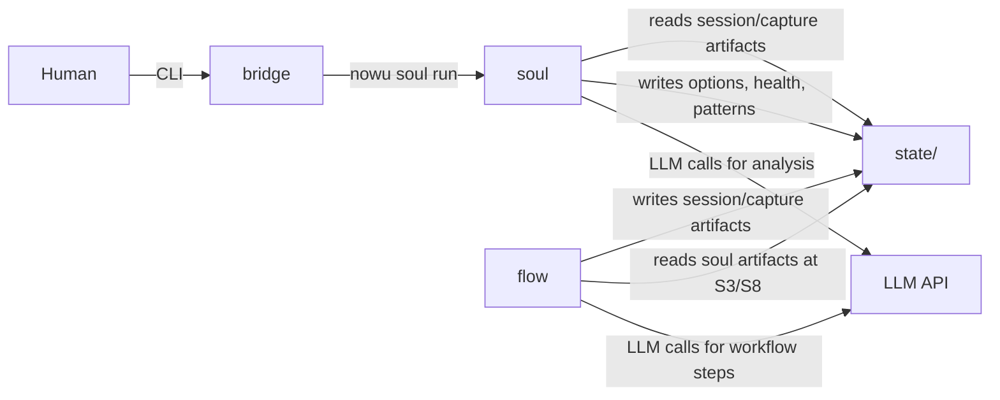
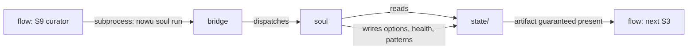

# Options Sheet — intake-004: Agent-Workflow Integration Pattern and LLM Call Ownership

---

## Coupling Pattern Decision (ADR-F)

### Option A: Artifact-Based Coupling — CONFIRMED VIABLE

`soul` reads `state/` artifacts produced by `flow` and writes its own insight
artifacts (`state/arch/`, `state/health/`) which `flow` reads on the next cycle.
No Python import or runtime function call crosses the `soul`↔`flow` boundary.
All coupling is at the file system level.

| QA Attribute     | Weight | Score | Weighted |
|------------------|--------|-------|----------|
| Simplicity       | 5      | H (3) | 15       |
| Testability      | 5      | H (3) | 15       |
| Modifiability    | 4      | H (3) | 12       |
| Performance      | 2      | M (2) | 4        |
| Migration Cost   | 3      | H (3) | 9        |
| **Total**        |        |       | **55**   |

**Tradeoff points:** Synchrony is weaker than a direct-call model — soul's output is
always one cycle behind the step that produced its inputs. Mitigated entirely by the
trigger model (see section below). Testability and modifiability are significantly
stronger than Option B because `flow` and `soul` can be tested with file fixtures and
share no mutable runtime state.

---

### Option B: Direct Function Call — BLOCKED

`flow` imports `soul` (or a `core`-contracted protocol) and calls
`soul.generate_options()` synchronously at the S3 step.

**Disqualified. Two independent constraints block it:**

1. **P3 constraint 4 (global-pass-2026-04-06):** "Direct imports between `flow`,
   `soul`, `know`, and `bridge` are forbidden. The only legal import graph is:
   all modules → `core`; `soul` reads/writes file artifacts owned by `flow`
   (no function call)." This is explicit binding language, not a directional preference.

2. **D-002 (DDD layer architecture):** Even if P3 constraint 4 were overridden via
   Tier 3 approval, `flow` importing `soul` directly remains forbidden — any call
   must be mediated by a Protocol in `core/contracts.py`. This would expose `soul`'s
   contractual surface to `flow` through `core`, creating tight interface coupling
   with no isolation boundary.

Pursuing Option B requires a Tier 3 constraint override. S3 does not recommend initiating
that override. **Option B is not evaluated further.**

---

### Option C: In-Process Event Bus — DISQUALIFIED

`flow` emits events; `soul` subscribes to them via an in-process event bus.

**Disqualified by two independent decisions:**

1. **D-003 (five-module ceiling) + P3 constraint 1:** A standalone event bus would
   require a sixth top-level module, forbidden without a superseding ADR and Tier 3
   approval. If forced into `core`, it violates `core`'s container definition
   ("a Python module — no I/O," zero UC ownership) and introduces a runtime
   capability into a layer defined as a typed contract surface.

2. **D-007 (integration-first monolith for v1):** D-007 explicitly chose against
   in-process event bus complexity for v1.

**Option C is not evaluated further.**

---

## Triggering Model Sub-Options (The Real Decision)

Option A being the only viable coupling pattern does not close the design. The
operational gap it creates — soul must produce its artifact before `flow` reaches
S3, but the file system model does not define when soul runs — is the genuine
architectural decision at the centre of this spike. Three sub-options exist:

- **Trigger A1:** The curator step (S9) invokes soul as a subprocess via `bridge` CLI
- **Trigger A2:** Explicit CLI entry point only — human invokes `nowu soul run` manually
- **Trigger A3:** Trigger-file pattern — `flow` writes a trigger file at S9; soul reads it

---

### Trigger A1: S9 Curator Invokes Soul

At the close of every S9 (curator) step, `flow`'s S9 orchestration executes
`nowu soul run` via the `bridge` CLI as a subprocess call. Soul runs to completion,
producing options artifacts, health metrics, and pattern records. The cycle closes
with soul's artifacts present. `flow`'s S3 on the next cycle reads the artifact
produced at the prior S9.

The subprocess call is an OS-level invocation via `bridge` — not a Python import or
function call between `flow` and `soul`. Compliant with P3 constraint 4.

**Pros:**
- Artifact guaranteed present when the next S3 runs — closes NF-13 synchrony gap with
  zero human discipline required.
- Extends the NF-11 (drift detection triggered by curator) pattern already in the UC matrix.
- All three affected UCs served: NF-13 and NF-06 at S9 close; NF-08 via the same CLI
  entry point on demand.
- Soul runs with maximum context — all S9 artifacts committed before analysis.

**Cons:**
- Soul's LLM call is in S9's critical path; LLM failure must be handled non-fatally.
- Options artifact is one cycle old when S3 reads it — minor staleness risk.
- Every S9 runs soul regardless of whether NF-13's output is immediately consumed.

**Risks:**
- **[HIGH] Soul failure makes S9 non-deterministic without explicit error policy.**
  Mitigation: soul failure at S9 is non-fatal. S9 logs the error, writes
  `state/soul-error.yaml` sentinel, and completes normally. S3 checks for artifact
  presence at startup and raises an explicit error if absent.
- **[LOW] Staleness gap.** S3 logs a staleness warning based on artifact timestamp if
  more than one cycle gap is detected.

| Criterion | Score |
|---|---|
| NF-13 synchrony guarantee | HIGH |
| NF-08 independent invocation | HIGH |
| NF-06 automatic coverage | HIGH |
| S9 critical-path risk | Present (managed) |
| New coordination primitives | None |
| Human discipline required | None |
| Implementation complexity | LOW |

---

### Trigger A2: Explicit CLI Entry Point Only

Soul has its own `nowu soul run` entry point in `bridge`. It is the human's (or a
scheduled job's) responsibility to invoke it before beginning S3. `flow` makes no
pipeline-level call to soul at any point.

**Pros:**
- Cleanest separation — `flow` has zero knowledge of soul's execution lifecycle.
- Soul LLM failures are fully isolated from S9.
- Soul can be invoked multiple times between cycles.

**Cons:**
- NF-13 synchrony is entirely dependent on human discipline. If the human forgets
  `nowu soul run`, S3 has no options artifact. The system provides no guarantee.
- NF-06 pattern detection also relies on human invocation.

**Risks:**
- **[HIGH] NF-13 synchrony gap is structurally unresolved.** A2 defers it to the human.

| Criterion | Score |
|---|---|
| NF-13 synchrony guarantee | LOW |
| NF-08 independent invocation | HIGH |
| NF-06 automatic coverage | LOW |
| S9 critical-path risk | None |
| Human discipline required | HIGH |
| Implementation complexity | LOWEST |

---

### Trigger A3: Trigger-File Pattern

`flow` writes `state/soul-trigger.yaml` at S9 close listing pending soul work items.
Soul's `nowu soul run` reads this file on startup, processes listed items, marks the
trigger consumed, and writes output artifacts.

**Pros:**
- Fully artifact-based: `flow` and `soul` communicate only through files.
- Provides a lightweight audit trail of soul invocations.
- S3 can detect a pending (unconsumed) trigger and warn the human before proceeding.

**Cons:**
- Adds a coordination primitive with its own schema, read/write implementation in both
  modules, and edge-case handling (partial consumption, interrupted runs).
- Does not resolve the invocation problem — something must still invoke soul.
- Adds schema drift risk between the trigger producer (`flow`) and consumer (`soul`).

**Risks:**
- **[MEDIUM] Trigger-file schema drift.** If format evolves without updating soul's reader,
  consumer silently fails or raises opaque errors.
- **[MEDIUM] Consumed trigger with absent artifact** (soul crashes mid-run).

| Criterion | Score |
|---|---|
| NF-13 synchrony guarantee | MEDIUM |
| NF-08 independent invocation | MEDIUM |
| NF-06 automatic coverage | MEDIUM |
| New coordination primitives | Trigger-file schema |
| Implementation complexity | HIGHEST |

---

### Trigger Sub-Option Summary

| Criterion                    | A1: S9 Invokes | A2: CLI Only | A3: Trigger File |
|------------------------------|---------------|--------------|-----------------|
| NF-13 synchrony guarantee    | HIGH          | LOW          | MEDIUM          |
| NF-08 independence           | HIGH          | HIGH         | MEDIUM          |
| NF-06 automatic coverage     | HIGH          | LOW          | MEDIUM          |
| S9 critical-path risk        | Present (mgd) | None         | None            |
| New coordination primitives  | None          | None         | Trigger schema  |
| Human discipline required    | None          | HIGH         | MEDIUM          |
| Implementation complexity    | LOW           | LOWEST       | HIGHEST         |

**Sensitivity point:** The trigger model determines whether NF-13 synchrony is a system
guarantee or a human convention.

**Tradeoff point:** A1 guarantees synchrony at the cost of adding soul to S9's path
(managed risk). A2 eliminates that risk but transfers it to the human. A3 adds complexity
without fully resolving A2's gap.

---

## Q4 — LLM Call Ownership (Resolved)

Q4 is not an independent decision. Under Option A (artifact-based coupling), `flow` and
`soul` share no runtime communication channel. There is no mechanism for `flow` to route
LLM calls through `soul` at runtime without a function call — which Option A forbids.

**Q4 resolution: Each module instantiates its own independent LLM client.**

- `flow` calls the LLM API directly for workflow agent steps.
- `soul` calls the LLM API directly for its analytical operations.
- Neither module is dependent on the other's LLM client at runtime.

This matches the C4 L2 diagram in global-pass-2026-04-06, which already shows two
separate arrows from `flow` and `soul` to LLM API.

**Operational corollary:** A shared `LLMConfig` dataclass in `core` (API key from
environment, model name, timeout) is recommended to eliminate credential duplication
without creating a shared client object. Each module reads config at startup and
instantiates its own client. Compliant with D-002; creates no runtime dependency.

**Q4 is closed.**

---

## Recommendation

**Recommended: Option A (artifact-based coupling) + Trigger A1 (S9 curator invokes soul)**

**Coupling:** Option A is confirmed as the only viable design. Options B and C are blocked
and disqualified by binding constraints (P3 constraint 4, D-002, D-003, D-007). The
"artifacts are the API" principle is confirmed unchanged.

**Trigger:** A1 is recommended over A2 and A3 for one decisive reason: it is the only
sub-option that closes the NF-13 synchrony gap without human discipline. The global-pass
UC matrix already establishes the "soul triggered by curator step" pattern via NF-11; A1
extends this model to NF-13 and NF-06 rather than inventing a new coordination mechanism.

Note: Trigger A2's `nowu soul run` CLI entry point is a prerequisite of A1 — it is the
invocation mechanism S9's subprocess call uses. It simultaneously satisfies NF-08's
independent health check invocation model. A1 is therefore a superset of A2.

**What ADR-F must record:**

1. Integration pattern: Artifact-based (Option A). No runtime function call between
   `flow` and `soul`. Soul reads `state/` produced by `flow`; writes to `state/arch/`
   and `state/health/`.
2. Trigger model: S9 curator step invokes soul via `bridge` CLI subprocess (Trigger A1).
   Soul failure is non-fatal to S9; S3 verifies artifact presence at startup.
3. LLM ownership: Dual independent clients (Q4 resolved). `core` provides a shared
   `LLMConfig` dataclass — not a shared client object.
4. Bridge CLI entry point: `nowu soul run` is soul's public invocation interface.
5. Artifact schema: Soul's output artifacts must be typed as dataclasses in
   `core/contracts.py` and validated at both write boundary (soul) and read boundary (flow).
