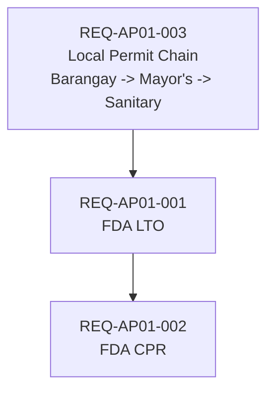

# AP-01 Mini Regulatory Dependency Graph (Philippines)

## Scope

This artifact captures a minimal, dependency-linked regulatory chain for a small Philippine aperitif business preparing to sell a bottled alcoholic beverage.

## Requirements

### REQ-AP01-001 — FDA License to Operate (LTO)

- **requirement_id**: REQ-AP01-001
- **title**: FDA License to Operate (LTO) for food business operator/manufacturer
- **regulatory_body**: Food and Drug Administration (FDA Philippines)
- **status**: NOT_STARTED
- **dependencies**:
  - REQ-AP01-003
- **confidence_level**: MEDIUM
- **source**: FDA Center for Food Regulation and Research (CFRR) licensing guidance; LGU/FDA process notes from intake research
- **renewal_frequency**: Annual or as stated by current FDA category rules (verify at filing time)

### REQ-AP01-002 — Certificate of Product Registration (CPR)

- **requirement_id**: REQ-AP01-002
- **title**: Certificate of Product Registration (CPR) for bottled aperitif SKU
- **regulatory_body**: Food and Drug Administration (FDA Philippines)
- **status**: NOT_STARTED
- **dependencies**:
  - REQ-AP01-001
- **confidence_level**: HIGH
- **source**: FDA product registration requirements for processed food/beverage products
- **renewal_frequency**: Multi-year validity per product registration class; revalidation required before expiry

### REQ-AP01-003 — Local Permit Chain (Barangay → Mayor's Permit → Sanitary Permit)

- **requirement_id**: REQ-AP01-003
- **title**: Local government permit sequence for legal business operation
- **regulatory_body**: Barangay LGU + City/Municipal LGU + City/Municipal Health Office
- **status**: IN_PROGRESS
- **dependencies**: []
- **confidence_level**: MEDIUM
- **source**: Typical LGU sequencing for food and beverage operations in the Philippines; local city hall business permit checklist conventions
- **renewal_frequency**: Annual (commonly aligned with business permit renewal cycle)

## Mermaid Dependency View

## Notes on Ordering

1. Local permit sequence (REQ-AP01-003) is treated as foundational operational legitimacy evidence for the facility/business.
2. FDA LTO (REQ-AP01-001) is represented as blocked until local foundational permits are in place.
3. CPR (REQ-AP01-002) is blocked until the LTO is active.

## Representational Limits

### What CAN be expressed with current nowu artifact structure

- Frontmatter metadata tying AP evidence to `intake_id` and `decision_id`.
- Requirement-level records with explicit `requirement_id`, status, dependency references, confidence, and source notes.
- Human-readable dependency order via Markdown lists and Mermaid.

### What CANNOT be expressed with current structure

- No automated dependency traversal to compute a live critical path.
- No automated staleness alerts when regulatory guidance changes.
- No query engine for "show all blocked requirements" or reverse dependency lookup.
- No structured deadline/renewal date fields for permit expiry and renewal deadlines; timing is prose-only.
- No jurisdiction/body variation model to encode location-specific differences (e.g., Manila vs province permit requirements).
- No source citation granularity/provenance schema to pin each requirement to specific regulation text and rule version.
- This is a minimal slice covering FDA/LGU only, not the full "legally sell" chain (BIR, DTI, excise are outside this demo).

### Follow-on work references

- **K3**: Knowledge persistence/query surface expansion needed for machine-queryable dependency traversal.
- **K13**: Regulatory tracking capability needed for automated refresh/staleness handling and operational permit lifecycle support.
