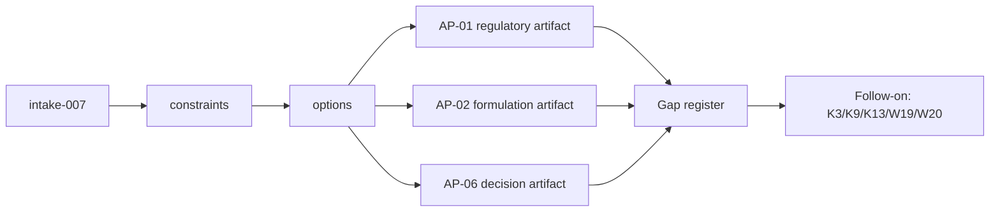

# Decision Handoff: intake-007

## What Was Decided

D-027 selects Option A (Artifact-Only Validation) for W27. AP-domain knowledge (regulatory
requirements, formulation versions, business decisions) will be represented using existing
workflow artifact structures with no protocol or source code changes. Gaps where current
structures cannot express AP-domain requirements will be documented in a dedicated gap
register with traceability to K3, K9, K13, W19, and W20.

## Chosen C4 L2 View



## Key Constraints for Shaper

1. No changes to src/ or tests/ — all deliverables are state/ artifacts.
2. No MemoryService expansion — gaps documented, not implemented.
3. AP-06 is the primary proof point; AP-01/AP-02 are secondary (minimal representation + gap documentation).
4. DecisionRecord has only 5 fields — supplementary artifact structure needed for AP-06 demo; gap must be documented.
5. `know` remains WATCH — no direct know API usage in this intake.
6. Total effort must fit within 6h (2h buffer against 8h appetite).

## Suggested Task Decomposition (hint — not binding)

1. Create fit-assessment artifact mapping AP needs to existing contracts/schemas.
2. Walk one AP-06 business decision through existing S1-S9 artifact shapes (primary proof).
3. Create AP-01 mini graph (2-3 linked regulatory requirements with dependency references).
4. Create AP-02 mini version chain (2 formulation versions with rationale).
5. Write dedicated gap register with structured entries (gap_id, affects_uc/ac, missing_capability, workaround, target_work_item, severity).
6. Write claim-boundary section: what W27 proved, what remains blocked, which work item owns each gap.

---
```yaml
from_step: S4
to_step: S5
agent: nowu-shaper
status: READY_FOR_SHAPING
```
