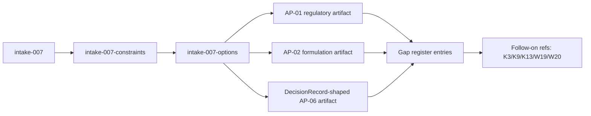
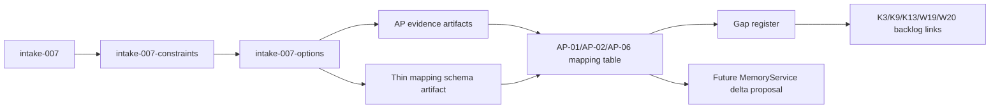
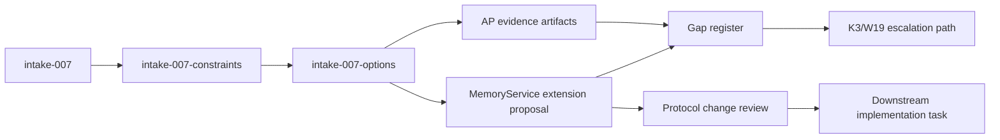

# Options Sheet

## Option A: Artifact-Only Validation (Pre-Integration Proof)

Summary: Represent AP-01/AP-02/AP-06 fully as state artifacts using existing workflow shapes and contract-compatible fields, with explicit gap notes and no protocol changes.



**Deliverables (end of 8h):**
- One AP-06 decision packet walked through existing S1-S9 artifact shapes (primary proof).
- One AP-01 mini graph: 2-3 linked regulatory requirements showing dependency references.
- One AP-02 mini version chain: 2 formulation versions with rationale for change/abandonment.
- One fit-assessment mapping AP needs to DecisionRecord, TaskSpec, MemoryService, and ADR-0008 atom fields.
- One dedicated gap register (gap_id | affects_uc/ac | missing_capability | workaround | target_work_item | severity).
- Claim-boundary section: what W27 proved, what remains blocked, which follow-on work item owns each gap.

**Use-case coverage (AP-01/AP-02/AP-06):**
- AP-01: Represent requirement metadata and dependency ordering as artifact references (claim = representability, not execution).
- AP-02: Represent formulation evolution with explicit version and supersedes linkage in artifacts.
- AP-06: Use DecisionRecord-compatible decision content as primary equivalence proof to NF-02 pattern. Note: DecisionRecord has only 5 fields (title, rationale, risks, mitigations, use_case_ids) — insufficient for full AP-06 evidence chain (options, criteria, weighted scoring). Gap must be documented; supplementary artifact structure used for demonstration.

**Pros:**
- Highest alignment with revised intake scope (evidence run, not capability completion).
- Lowest dependency and migration risk (no MemoryService or know surface change).
- Fastest path to appetite-safe output while preserving architectural honesty.

**Cons:**
- Produces no executable integration proof against know atom APIs.
- AP-01 dependency traversal and AP-02 comparisons remain conceptual/manual.
- DecisionRecord narrowness remains unresolved (only documented).

**Option-specific risks:**
- Stakeholders may misread artifacts as delivered runtime capability.
- Manual representational conventions may drift without a schema guard.

| QA Attribute | Weight | Score (H=3 M=2 L=1) | Weighted |
|---|---|---|---|
| Simplicity | 5 | H | 15 |
| Testability | 5 | H | 15 |
| Modifiability | 4 | M | 8 |
| Performance | 2 | L | 2 |
| Migration Cost | 3 | H | 9 |
| **Total** | | | **49** |

**Sensitivity points:**
- If artifact relation conventions are ambiguous, AP-01/AP-02 confidence drops sharply.
- If AP-06 proof overfits DecisionRecord, equivalence claim weakens under later audit.

**Trade-off points:** Maximizes simplicity and migration safety, but sacrifices near-term query/performance realism.
**Recommended:** true
**Effort:** 6h -- within appetite
**Migration path:** Current state -> create representative AP artifacts in state/ -> attach gap register with K3/K9/K13/W19/W20 traceability -> hand off for S4 decision.

## Option B: Artifact Validation + Thin Schema Proposal

Summary: Deliver the same artifact-level proof as Option A plus a lightweight schema supplement that defines how AP relationships should map to future MemoryService/know integration.



**Use-case coverage (AP-01/AP-02/AP-06):**
- AP-01: Defines dependency relationship representation now and explicit future mapping to graph/connection semantics.
- AP-02: Defines version/supersedes expression now and future version-chain handling expectations.
- AP-06: Uses DecisionRecord-compatible baseline plus supplementary decision-evidence mapping fields (outside contract, artifact-only).

**Pros:**
- Stronger modifiability and handoff quality to K3/W19 than pure artifact-only approach.
- Reduces ambiguity by standardizing relationship/versioning conventions early.
- Keeps implementation deferred while still clarifying future integration contract pressure.

**Cons:**
- Slightly higher scope risk inside 8h due to extra schema/design artifact.
- Could be interpreted as premature design commitment before S4 decision.
- Adds documentation maintenance burden.

**Option-specific risks:**
- Thin schema may be treated as de facto contract without ADR promotion.
- Over-specifying mapping may constrain better K3/W19 solutions later.

| QA Attribute | Weight | Score (H=3 M=2 L=1) | Weighted |
|---|---|---|---|
| Simplicity | 5 | M | 10 |
| Testability | 5 | H | 15 |
| Modifiability | 4 | H | 12 |
| Performance | 2 | M | 4 |
| Migration Cost | 3 | M | 6 |
| **Total** | | | **47** |

**Sensitivity points:**
- Value depends on quality of mapping granularity; too vague gives little benefit, too specific creates lock-in.
- AP-06 supplementary evidence structure must stay explicitly non-binding.

**Trade-off points:** Improves modifiability and future readiness, at the cost of simplicity and slightly higher migration effort now.
**Recommended:** false
**Effort:** 8h -- within appetite
**Migration path:** Current state -> complete Option A evidence artifacts -> add thin schema mapping artifact -> register unresolved contract deltas for K3/W19 -> S4 decision on adoption level.

## Option C: Artifact Validation + Minimal Contract Extension Slice

Summary: Produce artifact evidence and include a minimal MemoryService extension proposal (1-2 new capability endpoints) to demonstrate an AP atom path, without full K3 implementation.



**Use-case coverage (AP-01/AP-02/AP-06):**
- AP-01: Proposes direct relationship-query capability as future protocol requirement.
- AP-02: Proposes version-aware retrieval capability as future protocol requirement.
- AP-06: Keeps DecisionRecord path and proposes richer evidence retrieval beyond current contract.

**Pros:**
- Most direct pressure-test of current contract insufficiency.
- Highest long-term architectural clarity on what K3/W19 must add.
- Better eventual performance path once implemented.

**Cons:**
- Highest governance risk (scope expansion pressure inside an evidence-only work item).
- Weakest fit to revised W27 framing and appetite discipline.
- Requires stronger Tier-2/Tier-3 coordination to avoid silent architecture drift.

**Option-specific risks:**
- Could trigger premature contract change without adequate ADR lifecycle.
- Increases risk of conflating “designed extension” with “delivered capability.”

| QA Attribute | Weight | Score (H=3 M=2 L=1) | Weighted |
|---|---|---|---|
| Simplicity | 5 | L | 5 |
| Testability | 5 | M | 10 |
| Modifiability | 4 | H | 12 |
| Performance | 2 | H | 6 |
| Migration Cost | 3 | L | 3 |
| **Total** | | | **36** |

**Sensitivity points:**
- Any protocol boundary change heavily impacts migration cost and governance workload.
- If extension scope is not tightly bounded, appetite fails quickly.

**Trade-off points:** Gains future performance and extensibility, but materially harms simplicity and migration cost in this cycle.
**Recommended:** false
**Effort:** 8h -- within appetite (high execution risk)
**Migration path:** Current state -> deliver artifact evidence baseline -> draft minimal protocol delta proposal -> open explicit follow-on item for K3/W19 implementation instead of in-cycle execution.

## Recommendation

Option A recommended because it has the highest weighted score, best fits the revised evidence-only scope, and minimizes dependency/governance risk while still covering AP-01, AP-02, and AP-06 plus required gap traceability.

**Escalation triggers:**
- If AP-06 cannot be expressed without inventing non-standard artifact structure → escalate to Option B or log AC-3 as only partially met.
- If AP intake processing requires any domain-specific branching in flow → T5 is not validated and W27 becomes a gap-finding run.

---
```yaml
from_step: S3
to_step: S4
agent: nowu-decider
status: READY_FOR_DECISION
```
