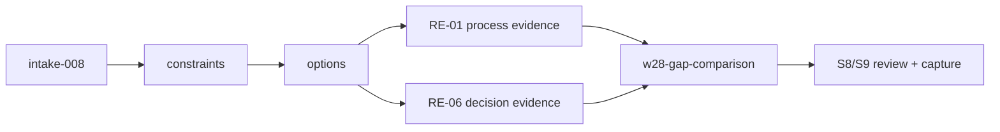

# Decision Handoff: intake-008

## What Was Decided

D-028 selects Option A for W28: artifact-only comparative validation for the RE domain,
anchored on RE-01 and RE-06, with mandatory classification of GAP-001..007 as systemic or
domain-specific using AP-vs-RE evidence.

## Chosen C4 L2 View



## Key Constraints for Shaper

1. No `src/` or `tests/` changes.
2. Deliverables must include explicit AP-vs-RE evidence links for each gap classification.
3. Classification rule is binding: systemic requires equivalent structural impact in >=2 domains.
4. S8 must include Oracle-style pre-review logic against intake ACs (D-SESS-01 guardrail).

## Suggested Task Decomposition (hint — not binding)

1. Task 014: Build RE evidence artifacts (RE-01/RE-06 representability + limits).
2. Task 015: Produce `w28-gap-comparison.md` with full GAP-001..007 classifications.
3. Task 016: Review/capture/session-learning and roadmap/session-log updates.

---

```yaml
from_step: S4
to_step: S5
agent: nowu-shaper
status: READY_FOR_SHAPING
```
