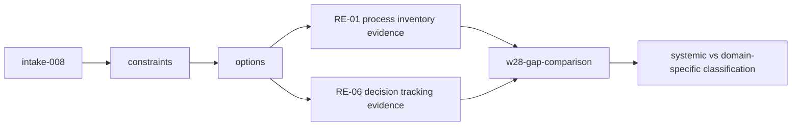
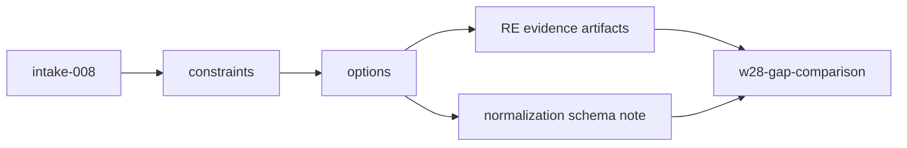
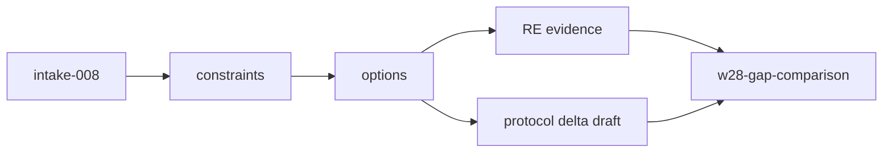

# Options Sheet: intake-008

## Option A: Comparative Artifact Validation (RE evidence + explicit GAP classification)

One-cycle artifact-only run: produce RE-01 and RE-06 evidence artifacts plus a formal AP-vs-RE
comparison that classifies GAP-001..007 under the W28 systemic rule.



**Pros:**
- Highest alignment with ROADMAP-004 validation goal.
- Produces direct cross-domain classification output.
- Lowest implementation risk (no code paths touched).

**Cons:**
- No executable integration proof.
- Quality depends on disciplined evidence depth.

**Risks:**
- Superficial RE artifacts could cause false domain-specific labels.
- Comparative reasoning could drift if AP baseline is not applied consistently.

| QA Attribute | Weight | Score (H=3 M=2 L=1) | Weighted |
|---|---|---|---|
| Simplicity | 5 | H | 15 |
| Testability | 5 | H | 15 |
| Modifiability | 4 | M | 8 |
| Performance | 2 | L | 2 |
| Migration Cost | 3 | H | 9 |
| **Total** | | | **49** |

**Sensitivity points:** Evidence completeness threshold; classification rigor.
**Tradeoff points:** Maximizes clarity and speed; minimizes runtime realism.
**Effort:** 6h (within appetite)
**Migration path:** Reuse W27 evidence format -> produce RE analogs -> classify all 7 gaps.
**Recommended:** true

## Option B: Comparative validation + thin normalization schema

Deliver Option A plus a schema proposal for standardized cross-domain evidence fields.



**Pros:**
- Better future repeatability for further domain runs.
- Stronger comparability framing.

**Cons:**
- Higher scope risk for W28.
- Adds design overhead not explicitly required by acceptance criteria.

| QA Attribute | Weight | Score (H=3 M=2 L=1) | Weighted |
|---|---|---|---|
| Simplicity | 5 | M | 10 |
| Testability | 5 | H | 15 |
| Modifiability | 4 | H | 12 |
| Performance | 2 | L | 2 |
| Migration Cost | 3 | M | 6 |
| **Total** | | | **45** |

**Sensitivity points:** schema granularity and non-binding framing.
**Tradeoff points:** better future structure vs greater immediate scope.
**Effort:** 8h (within appetite, tight)
**Migration path:** Option A outputs + additional schema artifact.
**Recommended:** false

## Option C: Comparative validation + proto-contract delta note

Deliver Option A plus explicit draft protocol deltas for MemoryService/DecisionRecord.



**Pros:**
- Most direct pressure-test for K3/W19/W20.

**Cons:**
- Highest governance/scope risk.
- Easily conflates evidence run with architecture change.

| QA Attribute | Weight | Score (H=3 M=2 L=1) | Weighted |
|---|---|---|---|
| Simplicity | 5 | L | 5 |
| Testability | 5 | M | 10 |
| Modifiability | 4 | H | 12 |
| Performance | 2 | M | 4 |
| Migration Cost | 3 | L | 3 |
| **Total** | | | **34** |

**Sensitivity points:** boundary between proposal and implementation.
**Tradeoff points:** clarity for future contract work vs immediate focus loss.
**Effort:** 8h (high risk)
**Migration path:** Option A outputs + protocol note artifact.
**Recommended:** false

## Recommendation

Option A is recommended: highest weighted score, best fit to W28 validation goal, and strongest
chance of producing clean RE evidence + full GAP-001..007 classification in a single cycle.

---
```yaml
from_step: S3
to_step: S4
agent: nowu-decider
status: READY_FOR_DECISION
```
